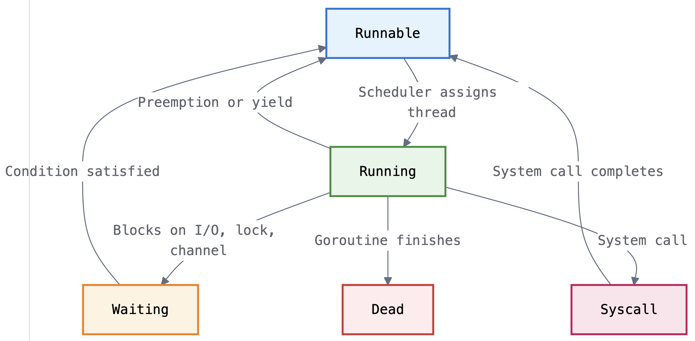

# Analysis on Various Overload Control Systems and their Limitaions

Recently, I have been thinking about concurrency control and overload control system. Overload control mainly has two pieces, detecting overload and handling overload. It is critical for maintaining the reliability from unexpected high load or failure. In industry, oftentimes it falls into SRE team's work. I picked four overload control systems, three from academia works (Breakwater, Protego, Rajomon) and one from cloud-native open-source proxy work (Envoy). In this post, I will analyze their detection mechanism to understand their design, and limitations. Their detailed overload handling algorithms are not the focus of this post. 

## Background
Before going into analysis of each system, let's talk about different states of thread and different categories of time that a thread/request goes through in its lifecycle. Different overload control systems use different thread state and time catogory, depending on their focus. I will use Go routine as a concrete example. It can be understood as general concept too in other languages. (You can roughly think of Go routine as a thread in other languages like C++ or Python. I will use them interchangeably in this post.)

### Goroutine States
Goroutine is a lightweight software thread managed by the Go runtime like C++'s `std::thread` or Python's `threading.Thread`. Goroutines are designed to be cheap to create and easy to manage, allowing developers to write concurrent programs without worrying about the underlying thread management. The Go runtime manages goroutines through a well-defined state machine. There are five primary states a goroutine can be based on its execution context.

**Runnable**: The goroutine is ready to execute and is waiting in the scheduler's run queue for an available OS thread. It has all the resources it needs except CPU time.

**Running**: The goroutine is currently executing on an OS thread, actively running application code.

**Waiting**: The goroutine is blocked, waiting for some condition to be satisfied before it can proceed. This includes waiting for I/O, locks, channels, timers, or other synchronization primitives. It is considered as non-runnable. It is also told as "parked" in Go term.

**Syscall**: The goroutine is blocked in a system call. The Go runtime treats this as a special case of waiting since the goroutine is not executing Go code.

**Dead**: The goroutine has finished execution and is being cleaned up by the runtime.

This is the State Machine of Goroutine States based on runtime events:



- **Runnable → Running**: Scheduler assigns the goroutine to an available OS thread
- **Running → Waiting**: Goroutine blocks on I/O, lock, channel, or other synchronization primitive
- **Running → Runnable**: Goroutine is preempted by the scheduler or voluntarily yields
- **Waiting → Runnable**: The condition the goroutine was waiting for is satisfied
- **Running → Syscall**: Goroutine makes a system call
- **Syscall → Runnable**: System call completes


### Request Processing Time Breakdown

When a thread is processed by a server, it goes through various stages that can be categorized into five different types of times a thread can be at a given time, Running, Runnable, Non-runnable, Context Switch, and GC Suspended.

Let's map each goroutine state to time category.

| Time Category | Goroutine State | Example Scenario | Is Included in Go Runtime Scheduling Latency |
|---------------|-----------------|------------------|---------------------------|
| Running | Running | Executing business logic, performing calculations | No (not latency) |
| Runnable | Runnable | Waiting for CPU thread, high concurrency | Yes  |
| Non-runnable | Waiting/Syscall | Blocked on mutex, I/O operations, channels, file operations | No |
| GC Suspended | Suspended | Garbage collection stop-the-world | No |
| Context Switch | ??? | State changes, scheduler overhead | No |

* The last column introduces new term, 'Go runtime scheduling latency'. It has time that a thread spent in runnabale state, which means times spent on waitng to be scheduled (time between runnable and running state). In Go runtime's library, you can get this time by calling `/sched/latencies:seconds` metric.

* Don't get bothered by context switch overhead. We will consider it negligible in this post.

**Running Time**: The thread is executing application code on a CPU core. This includes performing calculations, executing business logic, processing data structures, and any active code execution.

**Runnable Time**: The thread has work to do and is ready to execute, but is waiting for an available CPU thread. This occurs when:
- The system has more threads ready to work than available CPU cores
- High concurrency scenarios where threads compete for limited threads
- CPU-intensive workloads with many parallel operations

This time indicates resource contention at the system level. High runnable time means the system is CPU-bound.

**Non-runnable Time**: The thread is blocked, waiting for something to happen before it can continue. It's not ready to use CPU time because it's waiting for an external condition.

This includes:
- **Waiting for locks**: When a thread tries to acquire a mutex that another thread is holding, it gets parked until the lock becomes available.
- **Waiting for I/O operations**: Network calls, database queries, file operations - anything that involves waiting for external systems.
- **Waiting for channels**: When sending to a full channel or receiving from an empty channel.
- **System calls**: File operations, network operations, any interaction with the operating system kernel.

During non-runnable time, the thread isn't competing for CPU resources. It's waiting for something else to happen first.

**GC Suspended Time**: Time when the garbage collector forces all threads to pause. During "stop-the-world" phases, threads that were running or ready to run get suspended until garbage collection completes. This only happens in languages with garbage collection like Go, Java, or Python not in C, C++, or Rust.
If a thread was already non-runnable (blocked on I/O), it stays in that state since it wasn't running Go code anyway.

During GC pause:
- Goroutines executing Go code → get suspended
- Goroutines blocked on syscalls → remain blocked (unchanged)
- Goroutines waiting for locks → remain waiting (unchanged)

**Context Switch Time**: The overhead time spent transitioning between the above states. This includes:
- Saving and restoring goroutine state
- Updating scheduler queues
- Managing memory and stack information


### Overload Control System

#### Quick Comparison
This is the quick summary of . You can revisit this table after reading the entire section.

**What Each System Can and Cannot See**

| System | Measurement Layer | What It Sees | What It Misses | Deployment Reality | Call garph-aware |
|--------|------------------|--------------|----------------|-------------------|
| **Rajomon** | Go Runtime Scheduler | Goroutine scheduling delays | Lock contention, I/O waits, GC pauses, app-level queuing | ❌ Language-specific, incomplete overload detection | ✅ |
| **Breakwater** | OS Kernel Queues | True OS-level queuing | Application logic, multi-tenant noise, container isolation | ❌ Requires custom OS, incompatible with cloud | ❌ |
| **Protego** | Application Level | Lock contention delays, throughput efficiency | Network delays, OS-level queuing, non-lock bottlenecks | ❌ Requires application code changes, custom OS dependency | ❌ |
| **Envoy** | Network RTT | End-to-end latency changes | Network noise, non-queuing delays, root cause ambiguity | ✅ Deployable anywhere, but inaccurate | ❌ |

Each system operates at a different abstraction level, creating measurement gaps. The higher you measure, the more application context you have but generally the less universally deployable. The lower you measure, the more universally deployable but the less relevant to application specific behavior.

```
Application Level
    ↓ (gap: business logic, request prioritization)
Go Runtime Level   ← Rajomon measures here
    ↓ (gap: language-specific, lock contention, I/O waits)
OS Kernel Level    ← Breakwater and Protego measures here
    ↓ (gap: multi-tenancy, container isolation, deployment reality)
Proxy Level      ← Envoy measures here
    ↓ (gap: network noise, composite metrics, inference lag)
```

#### Overview
When servers receive more requests than they can handle efficiently, performance degrades rapidly. The core of overload control systems consists of two things. *1. how to detect overload* and *2. how to handle it when it happens*. In this post, we are going to focus on the first one, overload detection mechanism.

To discuss about overload detection mechanism, we need to define it first. What's the definition of being overloaded? 
It is "when the system cannot handle incoming requests without significantly degrading performance". Okay, then how should we detect the performance degradation?

High CPU utilization? High load (RPS)? High memory usage? High error rate? High queue length? High queueing delay? What queue should we use? High latency? What latency? Compute, network, end-to-end? or all of them?

Good overload detection should be quick and the detection technique should be  easy to apply and universal. CPU utilization sounds reasonable. This metric is easy to get and exists everywhere. However, it might be slow. High memory usage is not the direct load indicator and will be definitely too risky to use it alone (OOM crashes the program. This is the worst). High error rate? Even if it is overloaded, requests might not fail immediately, so high error rate might not be the best indicator too. RPS is not a good indicator either because it is not directly related to performance degradation. 

Rajomon, Breakwater, and Protego use "queuing delay" to detect overload. They try to either guess the queueing or directly observe the queue. Queue can be built up in various places, such as CPU thread queue, I/O queue, lock queue, network queue, etc. Each focus on different queues. 
On the other hand, Envoy adaptive concurrency controller uses end-to-end RTT. (Is it basically same as queueing delay? We will discuss it later in this post.)

There are different sources of high latency, for example, CPU overload, I/O overload, lock contention, memory pressure, network failure, etc. CPU overload makes thread wait in the queue (runnable, assuming it is satisfying the runnnable conditions), I/O overload makes thread wait for I/O operation to complete (non-runnable), lock contention makes thread wait for lock to be released (non-runnable), memory pressure triggers garbage collection in Go and Python (non-runnable), network failure makes thread wait for the response from downstream service (non-runnable) consuming CPU and memory resources.

Let's see how each system is designed to detect overload and what are the limitations of each system.

#### Rajomon

NOTE: I am not going to discuss Rajomon's decentralized algorithm deeply; pricing, token, price propagation, per-interface admission control, etc. In this post, I am only focusing on overload detection mechanism.

Rajomon is a decentralized overload control system published at NSDI 2025. The core of its overload detection mechanism is to measure queueing delay and convert it to price. The price is calculated for each interface in each service. And all the prices of downsteram service will propgagte to the upstream. Upstream services receives updated price of downstream service will add them up. At the client (entrance), each request gets a certain number of tokens assigned. While traveling, at every hop, Rajomon (implemented as grpc intercept) will check if the request has enough token, higher measures "runnable time" - the time goroutines spend waiting to be scheduled on CPU threads. It uses Go's built-in runtime metric `/sched/latencies:seconds` to detect when the system is under scheduling pressure.
Rajomon monitors the Go runtime's scheduling histogram, which tracks how long goroutines wait between becoming "runnable" and actually starting to execute.
When a system is CPU-overloaded, goroutines spend more time in the "runnable" state waiting for available CPU cores. By monitoring this specific type of delay, Rajomon detects CPU-based overload.

Hence, Rajomon cannot detect other sources of overhead such as, lock contention overload, I/O-based overload, Memory pressure (GC effect), metwork latency, or application internal queueing.

##### Limitations

However, Rajomon has critical limitations. Out of the five categories of the times, Rajomon only sees one type of time.

**The Measurement Gap**

When a goroutine blocks on a lock, it undergoes this sequence:

1. **Lock attempt fails** → `runtime.gopark()` called
2. **Goroutine state** → Changes to "waiting" (NOT runnable)
3. **Scheduler action** → Removes goroutine from runnable queue
4. **Lock becomes available** → `runtime.goready()` called
5. **Goroutine state** → Changes to "runnable" (measurement starts here)
6. **Eventually scheduled** → Starts executing (measurement ends here)

The time spent in steps 1-4 (actual lock waiting) is NOT measured by Rajomon's `/sched/latencies:seconds` metric. Only the time in steps 5-6 (waiting to be scheduled after the lock is available) gets captured.

Lock contention creates scheduling delay, but most of the contention time is invisible to Rajomon. The measurement philosophy treats lock waiting as "application logic" rather than "scheduler inefficiency."

Similarly, when a goroutine makes a system call for I/O, it calls `runtime.entersyscall()` which marks it as "in syscall" - a special non-runnable state. The goroutine stays in this state until the kernel operation completes, at which point `runtime.exitsyscall()` makes it runnable again. All the I/O waiting time is invisible to scheduling metrics.


**Network latency and failure blindness**: Rajomon cannot detect overload caused by network issues between microservices, such as increased latency to downstream services. Network I/O operations place goroutines in non-runnable states, making this time invisible to scheduling metrics. However, network failures do cause overload by forcing applications to spawn more goroutines for new requests while existing ones remain blocked, leading to cpu resource exhaustion, memory resource exhaustion, connection pool exhaustion.

**Garbage collection (GC) impact**: When GC is triggered in Go lang, all goroutines are paused and their states become "suspended" which is "non-runnable". Scheduling delay Rajomon uses does not capture this time. If the system is under memory pressure, GC pauses can significantly affect application performance. This could lead to overload situation but Rajomon does not see it.

**Cloud-native limitation**: Its current implementation also has limitation to be cloud-native. Rajomon is tightly coupled to Go's runtime internals and relies on Go-specific metrics like `/sched/latencies:seconds`. This creates a fundamental barrier to cloud-native adoption, where services are often written in different languages (Java, Python, Rust, etc.). The same logic can be implemented in other languages, but well I don't know if it is a good approach. It is not cloud friendly and high maintenance cost. And what if the language does not provide such metrics.

#### Breakwater
Breakwater is an overload control system published at OSDI 2019. It has a fundamentally different approach to overload detection by operating at the operating system level rather than the application runtime level. It instruments the *Shenango* operating system to measure actual queuing delays at two critical system bottlenecks in the request processing pipeline, **packet queue time** and **thread queue time**.
Packet queue time is the time between packet arrival and packet processing by the kernel. Thread queue time is the time between thread creation and thread execution by the OS scheduler (thread queue time is kinda similar to Rajomon's runnable time.)

Based on them, Breakwater defines the total queuing delay as:
```
Total queuing delay = max(packet_queue_delay) + max(thread_queue_delay)
```

Unlike Rajomon's focus on time spent on Go scheduler's runnable state, Breakwater measures actual resource queuing **at the OS level**. This captures:

- **Network processing delays** when packet rate exceeds NIC processing capacity
- **Thread scheduling delays** when thread creation exceeds OS scheduler capacity  
- **I/O processing delays** when disk/network operations queue up in kernel buffers

Breakwater's philosophy is that true overload manifests as queuing at the OS level, where actual system resources become the bottleneck. By measuring these fundamental queues, it can detect overload regardless of the application language or framework.

Hence, what Breakwater detects well are:
- **True system overload**: When the OS itself is overwhelmed with work, Breakwater sees the actual queuing happening at the kernel level.
- **Network saturation**: When packet processing falls behind, packets literally queue in kernel buffers - Breakwater measures this directly.
- **OS-level resource contention**: When multiple processes compete for system resources, the OS queues work - visible to Breakwater.
- **Hardware bottlenecks**: When CPU, memory, or I/O subsystems become saturated, the queuing appears in kernel data structures that Breakwater can observe.

##### Limitations

However, Breakwater has some critical limitation especially in cloud environment where multiple containers are running under the same OS kernel and resources.
In containerized environments that dominate modern deployments, multiple containers share the same OS queues. Therefore, Breakwater would measure **aggregate system queuing**, not per-container queuing. 
Another limitation is **Shenango Dependency**. It requires a completely custom operating system built specifically for low-latency applications.

***"I thought container was isolation boundary?"***

What containers isolate are
- Process namespaces
- Filesystem views
- Network interfaces (with proper configuration)
- CPU scheduling (with cgroups)
- Memory allocation (with cgroups)

What containers do not isolate are
- OS Kernel packet queues - where network packets are initially processed
- OS Kernel thread queues - where kernel schedules work
- Interrupt handling - hardware interrupts are handled by the shared kernel
- System call processing - all containers use the same kernel syscall interface

#### Protego
Protego: Overload Control for Applications with Unpredictable Lock Contention

Protego is an overload control system published at NSDI 2023. The overload control consists of two places. 1. Performance-driven (throughput) admission control and 2. active queue management 

Protego's overload detection mechanism has two components: **Performance-Driven Admission Control (Server level)** before forwarding request and **Active Synchronization Queue Management (Per lock level)** operating during request processing at each lock acqusition point.

##### Performance-Driven Admission Control
Protego has **performance-driven** admission control (This high level approach is same as Envoy adaptive concurrency.). Instead of using traditional overload control signals such as CPU utilization, or queueing delay, **it admits load as long as it observes throughput improvements**. It measures efficiency as the slope of the throughput curve, asking *"If I admit X more requests, do I get Y more completed requests?"*.

If throughput improvement with additional load is less than the efficiency threshold or if the drop rate exceeds the maximum drop rate, Protego stops accepting further load. 

Admission control core logic:
```
After increasing load by X:
if throughput_improvement < efficiency_threshold(te) * load_increase:
    Reduce admission (multiplicative decrease)
else:
    Increase admission (additive increase)
```

In this algorithm, maximum drop rate and efficiency_threshold are hyperparameters. Efficiency threshold (te): Default 10% in the paper. Efficiency threshold means how much improvement in throughput is required to admit(justify) additional load.

##### Active Synchronization Queue Management (ASQM)

Unlike Rajomon and Breakwater, which focus on queueing delay caused by CPU resourece contention, Protego focuses on queueing caused by lock contention. A request can experience contention when multiple requests attempt to access the same critical section.
Protego's active synchronization queue managament(ASQM) detects and handle it. It runs inside the application and operates at every lock acquisition point.

ASQM allows applications to abort requests when delays exceed latency objectives. ASQM caps the total time a request is allowed to spend in a queue, assigning each request a queueing delay budget computed by subtracting the 99th percentile network latency and 99th percentile service time from the target delay.

The target delay = SLO / maximum number of retries. A single request can be attempted multiple times at multiple servers. SLO and max number of retries should be given as parameters. (NOTE: Target delay ≠ SLO)

It first calculates the target delay based on SLO and max number of retries. And it calculates lock contention budget by `target delay - 99th percentile network latency - 99th percentile service time(actual compute time only)`. Don't get confused with service time. Usually service time includes lock contention time as well. Protego paper counts actual compute time only as service time. The paper is vague about how to measure actual compute time and network rtt which is not trivial. It blindly assumes that these metrics are available and accurate.

Before placing the request in each queue at **each lock**, it first checks the instantaneous queueing delay (time taken until acquiring the lock) of the certain lock and drops the request if the queueing delay of the target lock is greater than the request's remaining queueing delay budget.

Core logic:
```
At each lock:
if (current_lock_queue_delay > remaining_request_budget):
    Drop request immediately
else:
    Allow request to wait for lock
```

In timeline visualization, it looks like
```
<--------------------------------------E2E-------------------------------------->

<---Network-in--->

..................<---Lock-contention--->

...........................................<---Computation--->

..............................................................<---Network-out--->
```

E2E: end-to-end request latency

Network-in: network latency (inbound)

Lock-contention: lock queueing time (critical section waiting) *ASQM's target 

Computation: service time (processing)

Network-out: network latency (outbound)


To use Protego ASQM, the application should be rewritten to replace existing lock codes with the following Protego APIs. And to use this APIs, the application must run on the custom OS.
```go
bool mutex_lock_if_uncongested(mutex_t *);
bool condvar_wait_if_uncongested(condvar_t *, mutex_t *);
```

##### Pros
- **More application-aware**: ASQM operates at the application level, understanding request semantics and business logic
- **Proactive**: Can prevent overload rather than just detecting it after it happens

##### Limitation**
By design, it requires tight integration with application code! Applications must replace standard mutex_lock() calls with mutex_lock_if_uncongested(). In addition, application must handle state cleanup when ASQM drops a request. Also, Protego has Shenango dependency. It will only work with the custom OS.
These will be a huge barrier to adoption in existing applications or in cloud-native where you cannot modify the application code as infra.

Additionally, Protego ASQM allows requests to be dropped after they have been partially processed by the server, potentially modifying some states or reserving some resources. Thus, enabling Protego requires the application to perform all necessary clean-up after a request is dropped.

Regarding admission control, the reason that it has performance driven admission control is that its ASQM alone can only handle overload caused by lock contention. If CPU resources are overloaded only without lock being bottleneck, then ASQM will not do anything. Hence, you need more general overload control and that is its performance-driven admission control. One might say CPU contention makes the lock release slow and eventually affect the lock contention but it is not direct and the manifestation is not guaranteed to happen always.

Then, two questions. 1. does it work in general for other source of overloads too?, 2. will the algorithm work in microservice architecture application?
For the question 1, in Protego all other overload sources should be managed by admission control. Load increases -> check the throughput changes -> if throughput increases, then admit more load, if throughput decreases, then reduce the load. They use rate limiting as control mechanism. In other words, any overload that reduces the throughput will be detected by Protego admission controller. Then, we can rewrite the question. If overload happens, does the throughput always decrease? This turns out to be not true! For example, a service might maintain 1000 RPS throughput but with 99th percentile latency increasing from 10ms to 500ms due to I/O bottlenecks. Protego's admission control wouldn't detect this overload. And high tail latency is common.
For the question 2, 

**2. will the algorithm work in microservice architecture application?**
Let's assume a request flows through three services, A -> B -> C. and to be fair, let's assume that Protego is deployed on all three services.

Example,
```
Service C was overloaded.
Service C would detect its overload and reduce admission.
And now Service B would see reduced throughput due to C's admission control. Remember C is dropping and that will be manifested to B's throughput.
Hence, Service B reduces its own admission.
The same thing happens in Service A's admission control since it would see reduced throughput from B.
```

Actually, this is a good behavior. Earlier rejection is always better to prevent resource waste for requests that will be dropped anyway later. Also, user will get faster response.

Another issue is coordination lag. Changes propagate through the chain with delay. Since it is not coordinated, you simply wait for it to propagate by backpressure. At the worst case, it can cause oscillations in load control.


#### Envoy Adaptive Concurrency

Envoy is a cloud-native proxy designed to handle service-to-service communication in microservices architectures. Often it is deployed as a sidecar. One envoy instance is basically series of filters that process requests and responses. Adaptive concurrency filter is one of those filters that is designed to control the concurrency of requests sent to a backend service based on observed round-trip time (RTT) measurements. It is not a standalone overload control system like the other two, but it can be thought of as an overload control system in the context of preventing performance collapse and maintaining application performance.

Note that its objective might not be exactly same as the other two systems. Its objective is to keep the application staying at min RTT by controlling concurrency. In this post, I will think of it as another overload control system to compare with the other two.

**Deployment Compatibility**:
Envoy Adaptive Concurrency represents the most practically deployable approach among the three systems, operating as a part of Envoy proxy. It does not have language dependency. It does not require custom OS.


**High-Level Algorithm**
The intuition behind Envoy's adaptive concurrency filter is to dynamically adjust the number of concurrent requests sent to a server by comparing minimum RTT and the current RTT. The goal is to maintain near minimum RTT.
It uses gradient-based algorithm that automatically discovers the optimal concurrency level which is the maximum concurrency that achieves near-minimum RTT. It periodically explores the concurrency space, starting from minimum concurrency (e.g., 3) and gradually increasing it while monitoring the response times.

The core insight is that as concurrency approaches server capacity, response times should remain stable. Once concurrency exceeds capacity, requests begin queuing at the server, causing RTT to increase proportionally. By monitoring the relationship between concurrency and latency, Envoy attempts to find the "knee" of the latency curve - the point where additional concurrency starts causing disproportionate latency increases.

The key distintction between the above two overload control system's detection mechanism and Envoy adaptive concurrency is that it measures the RTT directly. It is simpler as in it only relies on RTT which is always observable and universal all applications. 

```
1. Find min RTT (every X seconds):
   - concurrency limit = min concurrency limit, e.g., 3
   - Measure RTT and update min_rtt

2. Update concurrency limit (every N samples):
   - Calculate RTT gradient = slope of recent RTT measurements
   - Calculate latency_increase = current_avg_rtt - min_rtt
   - If (latency_increase > threshold AND gradient > 0):
     - Decrease concurrency limit (multiplicative decrease)
   - Else if (gradient <= 0):
     - Increase concurrency limit (additive increase)
```

Envoy's "Queuing Detection" 
```
if RTT_current - RTT_minimum > threshold AND RTT_gradient > gradient_threshold
    Queueing = True 
else
    Queueing = False 
```

The philosophy of the algorithm is that increased RTT is again queuing.

The key distinction from others is that first it does not require custom OS (Breakwater), second it is not limited to a specific language (Rajomon), the third is that it blindly counts on the RTT. 
Regarding the third point, it is not good because it is coarse not differentiating scheduling delay (queueing delay), user-space processing time, syscall time, or network latency. But it is good because it includes all of them. In other words, it does not miss any latency increase! (unlike Rajomon and Breakwater)

The most significant one will be network latency since it is common. And it can happen not only due to actual backbone network failure but also due to back pressure from the downstream.

##### Limitations

The limitations of Envoy's adaptive concurrency filter are:

**RTT is a Composite Metric**: Envoy's RTT includes multiple unrelated components:
- Network latency
- Server processing time
- Server queuing time (the actual target)
- Proxy delays
- + All of downstream services' latencies

Should we reduce concurrency even when the source of increased RTT is network latency not server queuing?

Should we reduce concurrency even when the source of increased RTT is downstream not server queuing?

***TODO(gangmuk): ... needs more thoughts on this.***

###### Network Noise Pollution
What Envoy measures:
total_RTT = network_latency + server_processing + server_queuing + client_overhead

What Envoy wants to measure:
server_queuing_only (???)

And network_latency can vary dramatically even without server overloaded.

Real scenario: Server queue builds up over 10ms

Network variance: ±50ms between client and server

Signal-to-noise ratio: 10ms / 50ms = 20% signal, 80% noise

###### Multi-Cluster(network) and Heterogenous Cluster(compute)

There are multiple instances for each downstream service and based on where the request is routed, each can experience different latency due to different size of the instances, different load in each instance, or different network latency to each downstream instance. Different requests will travel through different paths (instances) of downstream call graph. However, adaptive concurrency filter on one of upstream service instance does not differentiate where a given request was routed to in each downstream service. 

For example, let's say a request will flow through three services, A -> B -> C. And there are two instances of each service, A1, A2, B1, B2, C1, C2. X1 instances are in west cluster and X2 instances are in east cluster. 

A latency = 5ms, B latency = 5ms, C latency = 5ms
Network latency between X1 instances: 4ms
Network latency between X2 instances: 4ms
Network latency between X1 and X2 instances: 20ms
1. A1 -> B1 -> C1: 5ms(A1) + 4ms(A1->B1) + 5ms(B1) + 4ms(B1->C1) + 5ms(C1) = 23ms
2. A1 -> B1 -> C2: 5ms(A1) + 4ms(A1->B1) + 5ms(B1) + 20ms(B1->C2) + 5ms(C2) = 34ms
3. A1 -> B2 -> C1: 5ms(A1) + 20ms(A1->B2) + 5ms(B2) + 20ms(B2->C1) + 5ms(C1) = 54ms
4. A1 -> B2 -> C2: 5ms(A1) + 20ms(A1->B2) + 5ms(B2) + 4ms(B2->C2) + 5ms(C2) = 34ms

**Multi-cluster: different network latency**

What it tells is that the aggregated latencty from A1's perspective will depend on routing policy (In this post, I will ).
(It is assuming all the instances are having the same processing time.)

Let's assume that the routing policy (or load balancing policy) so that it only routes to the instance in the same cluster. A1 always routes to B1 and B1 always routes to C1. Then the average latency will be (23 + 23 + 23 + 23) / 4 = 23ms

Adaptive concurrency filter on A1  sees average latency (23 + 34 + 54 + 34) / 4 = 36.25ms

**Heterogeneous instances: different compute latency**

The similar problem arises by heterogeneous instances even if all are in the same network cluster with the same network latency. X1 instances have more CPU cores than X2 instances. Assuming round robin load balancing, load will be equally distributed to B1 and B2. and subsequently same from B to C. Adaptive concurrency filter on A1 instance will simply aggregate all the latencies as one group. There are four different paths possible that can be dispatched from A1 instance.

###### No Application Context
Cannot distinguish between "server is overloaded" vs "server is waiting for slow database" vs "network path changed" vs "server is performing legitimate expensive computation."

**Concurrency vs. Queue Length Confusion**: Envoy controls concurrency (number of simultaneous requests) as a proxy for controlling queue length, but these are different concepts. A server might handle high concurrency efficiently with no queuing, or might struggle with low concurrency due to internal bottlenecks.

## Conclusion

Request processing involves five distinct time categories, each telling a different story about system health. While Rajomon provides valuable insights into CPU scheduling pressure, Breakwater offers accurate but impractical OS-level measurements, and Envoy provides deployable but imprecise network-level inference, none of these approaches can match the accuracy and practicality of direct application-level queue measurement.

#### References
Envoy Adaptive Concurrency: https://www.envoyproxy.io/docs/envoy/latest/configuration/http/http_filters/adaptive_concurrency_filter

Rajomon: Decentralized and Coordinated Overload Control for Latency-Sensitive Microservices, NSDI 2025

Overload Control for µs-scale RPCs with Breakwater, OSDI 2020

Google's "The site reliability workbook": https://sre.google/workbook/table-of-contents/
