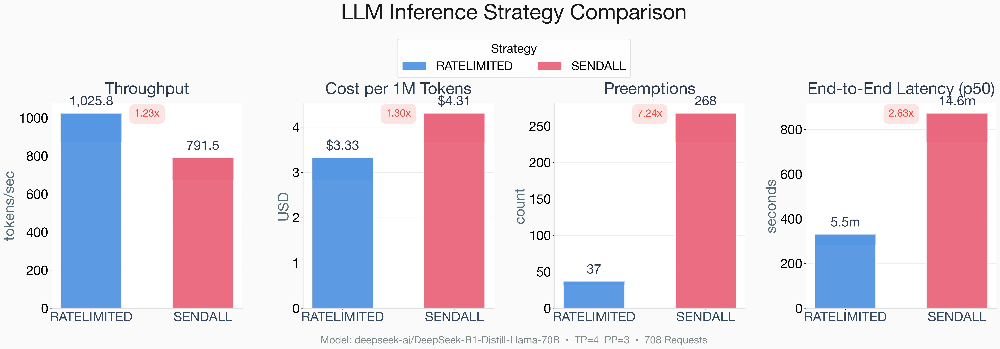
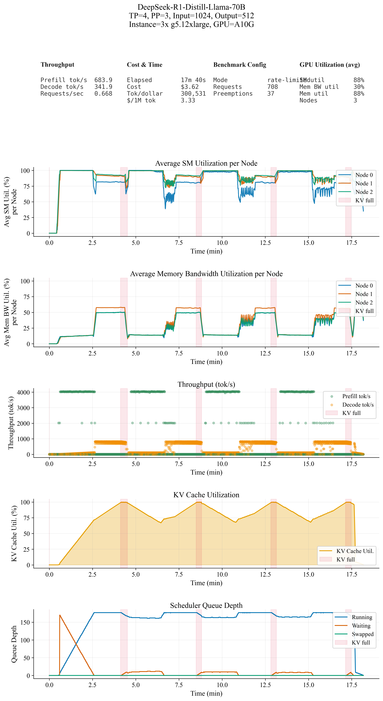
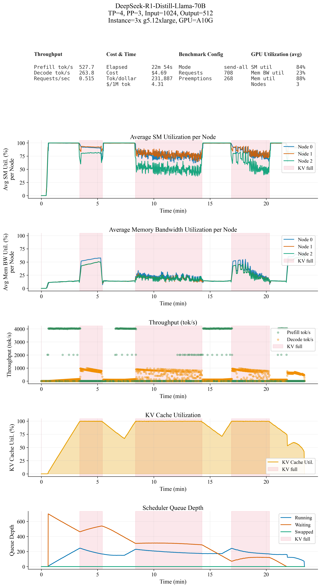

# Optimizing Batch LLM Inference 1: How to batch requests to maximize throughput

## Background: Offline batch inference

Online LLM inference cares about latency — time to first token, time per output token. There is another class of workload where latency doesn't matter — only total throughput and end-to-end job completion time do. This is offline batch inference.

In offline batch inference, you have a bulk of input prompts to run inference on. There is no per-request SLO; what matters is end-to-end job completion time. For example, 
 
*"Process my input file which has 10000 input prompt requests over night (~10h SLO)"*. 

Specific use cases include code review overnight, automatic image tagging on cloud photos, summarizing large document sets, and so on. Or it can be an aggregated set of inference requests submitted by different users that use the same model (e.g., ChatGPT supports batch inference for its users at a cheaper price).

Nobody is waiting for individual responses. What matters is throughput — maximizing tokens processed per second while finishing the whole job within the deadline.

## What this post is about

What's interesting about offline batch inference workloads is that we have more flexibility and control on scheduling than online inference since we are free from per-request latency constraints. There are many dimensions to optimize for batch inference: what GPUs to use, what parallelism strategy, what parallelism degree (which I will cover in a follow-up post). The question I wanted to answer in this post is: 

*How should we submit a batch of requests to the inference server (e.g., vLLM) to maximize throughput?*

The keyword is *how to submit*. There will be a client that pulls requests from a task pool (e.g., prompt list) and sends them to the vLLM server. How many requests should be submitted at once? Should we dump all at once? Submit one by one? Send in fixed-size batches? Does it even matter? This blog post answers it with real benchmark results run on AWS with vLLM.

It turns out it matters quite a bit — and understanding why requires knowing how vLLM's KV cache and scheduler work, which I will explain as we go.

<!-- (Btw, I won't talk about in what requests it should compose each batch in this post. It is another interesting question I had and I will design the benchmark and run it and cover it in another post hopefully soon...) -->

## The benchmark setup

Let's go into it directly. Benchmark setup first.

- Machine: AWS g5.12xlarge, (NVIDIA A10G)
- Engine: vLLM 0.10.0
- Model: DeepSeek-R1-Distill-Llama-70B, FP16
- Paralellism:
  - Tensor Parallelism: 4
  - Pipeline Parallelism: 3
  - Total 12 NVIDIA-A10G GPUs.
- Workload: 
  - Number of requests: 708
  - Input token length: 1024, 
  - Output token length: 512

## Two strategies to submit the requests

**send-all-at-once**: Submit all 708 requests at once. vLLM handles scheduling internally with its scheduler and KV cache manager.

**rate-limited submission**: Submit a fixed batch of requests at a time and wait for that batch to complete before submitting the next one.

Everything else is identical — same model, same hardware, same workload.

In **rate-limited submission**, the batch size is 177 in this benchmark. It is calculated from the workload's input/output token length and vLLM's total KV cache capacity: total KV cache tokens divided by the max sequence length gives the number of requests that can be simultaneously active.

The KV cache holds the key-value tensors for all tokens of all in-flight requests. Each decode step appends new KV entries, so KV cache usage grows until a request completes. The total capacity is fixed by GPU memory, which puts a hard ceiling on how many requests can be active at once.

### Calculation

70B model weights in FP16 ~= 140GB

TP=4, PP=3.

The model weights are split into 12 GPUs.
140GB / 12 ~= 12GB per GPU

NVIDIA-A10G GPU memory size = 24GB

vLLM reserves memory for KV cache as: `gpu_memory_utilization × total_GPU_memory - model_weights`. With `--gpu-memory-utilization 0.85`:

KV cache capacity per GPU = 24GB × 0.85 - 12GB ~= **7.1GB**

Per-token KV size **per GPU** for 70B model (accounting for TP=4, PP=3)Each GPU only stores 2 of the 8 KV heads (TP shards attention) and 27 of the 80 layers (PP assigns a layer slice per stage). The bottleneck is the pipeline stage with ceil(80/3) = 27 layers.

= 2 (K+V) × (8 KV heads / TP=4) × 128 (head dim) × (80 layers / PP=3) × 2 bytes (FP16)

= 2 × 2 × 128 × 27 × 2

= **27,648 bytes (~27 KB)**

The max number of tokens that one GPU's KV cache can hold = 7.1GB / 27,648 bytes = **~275,920 tokens**We did it this time for understanding and confirmation, but you don't need to do this calculation. You can get this number from vLLM server directly .

The max number of requests that can be simultaneously active 

= 275,920 tokens / (1,024+512) tokens per request 

= **~177 requests**

And this 177 will be used as batch size for rate-limited submission strategy.

## Results

Let's look at the results. 

  <figure style="flex:1; margin:0;">
    
    <figcaption style="text-align:center; font-size:0.85rem;">Figure 1. Comparison of throughput and cost between rate-limited submission and send-all-at-once submission.</figcaption>
  </figure>

 

Same hardware, same tokens, same weights. send-all-at-once submission has 22.8% lower throughput and 29.6% more cost.

The difference comes from how each strategy interacts with the KV cache under load. With the time series below let me show you what happens more in detail.

## Where the time goes

The two figures below show the time series of SM utilization, memory bandwidth utilization, throughput, KV cache utilization, and waiting queue length. Figure 2 (left) is the rate-limited run; Figure 3 (right) is the send-all-at-once run.

  <figure style="flex:1; margin:0;">
    
    <figcaption style="text-align:center; font-size:0.85rem;">Figure 2. Rate-limited submission (concurrency = 177)</figcaption>
  </figure>
  <figure style="flex:1; margin:0;">
    
    <figcaption style="text-align:center; font-size:0.85rem;">Figure 3. Send-all-at-once submission (708 requests at once)</figcaption>
  </figure>

**Figure 2 (rate-limited)** shows a clean periodic pattern. At each cycle, a new batch of 177 requests is submitted, producing a burst of prefill throughput at ~4,000 tok/s. During this phase, KV utilization is low, memory bandwidth utilization is low, and SM utilization is high — exactly what we expect from a prefill-dominated phase.

After the prefill burst, prefill throughput drops to zero and decode throughput ramps up to 750–1,200 tok/s. Memory bandwidth utilization rises and SM utilization falls. KV cache utilization builds steadily throughout the decode phase because all in-flight requests' KV tensors must stay resident in GPU memory until each request completes. It briefly hits 100% at the very end of each decode phase — just 8% of the total run. Then the batch drains, new requests are submitted, and the cycle repeats. The batch size of 177 was chosen precisely to match the KV cache capacity, so each batch fills the cache but doesn't overflow it.

**Figure 3 (send-all-at-once)** tells a different story. Minutes 0–5 look similar — one prefill phase, one decode phase. But from minutes 6–14, the KV cache stays pinned at 100% for an extended period. Memory bandwidth utilization is lower (~25% instead of ~50%) and decode throughput is erratic (scattered 0–1,000 tok/s instead of a steady ~1,000). A similar pattern reappears from minutes 17–20, even more chaotic. Both regions align perfectly with the red KV-full zone in the figures.

The cause is preemption. With 708 requests dumped into the waiting queue at once, the scheduler greedily admits requests until the KV cache is full. But decode is ongoing — each running request keeps generating new tokens, and each new token requires more KV space. When the cache overflows, the scheduler preempts a running request to free space, then immediately admits another from the still-full waiting queue, fills the cache back to 100%, and the cycle repeats. It is a self-reinforcing loop.

When a request is preempted, vLLM evicts **all** of its KV blocks — both the original prefill KV and every decode token generated so far — and moves it back to the waiting queue. When re-admitted, vLLM concatenates the original prompt with all previously generated tokens and re-runs the whole thing as a single prefill pass. That re-prefill burns real compute while producing zero new output tokens.

This is the core difference. In offline inference, if you dump your entire workload at once, you force a permanently deep waiting queue. The scheduler ends up with the KV cache pinned at 100% for most of the run, preempting in a loop, wasting compute on re-prefill. Rate-limited submission avoids this by keeping exactly enough in-flight requests to fill the cache — no more.

 
## So...

In offline batch inference, you have more flexibility on scheduling thanks to relatively loose SLO. Request submission strategy is simple but rather effective and important point in offline batch inference to increase the throughput. Not only this scheduling but it generally needs different scheduling in other problems too. This is one of them I will show how complex it can be in another post soon.